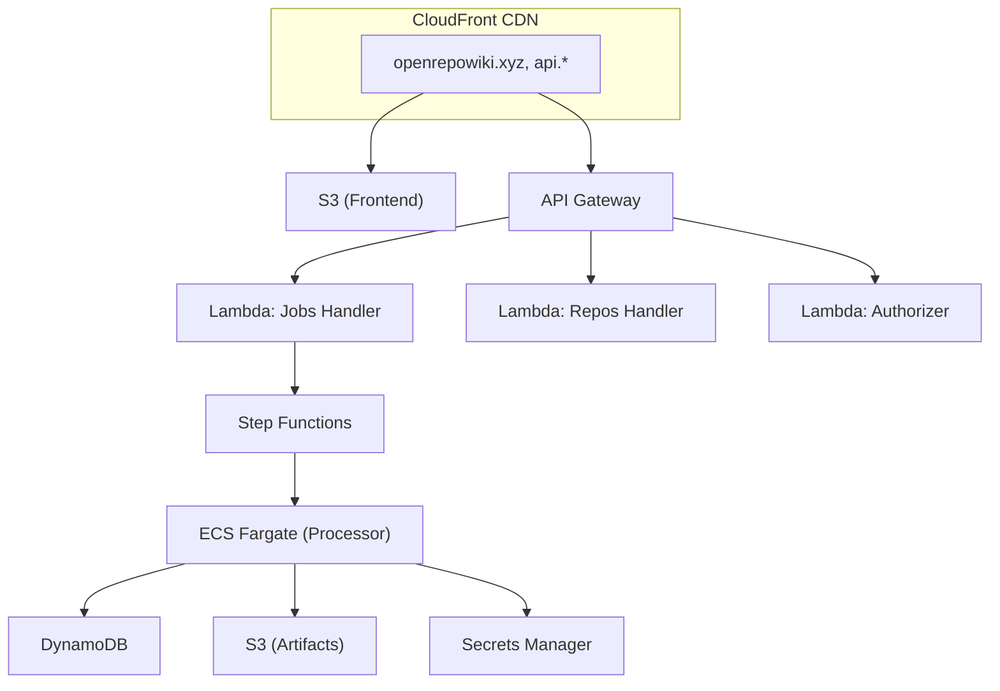

# OpenRepoWiki


**OpenRepoWiki** automatically generates comprehensive wiki documentation for any GitHub repository. Stop reading through endless code files - get instant insights into what each file and folder does.

**Live Demo:** [openrepowiki.xyz](https://openrepowiki.xyz)

## ✨ Features

- **Automated Wiki Generation** - Creates detailed summaries of repository purpose, functionality, and architecture
- **Codebase Analysis** - Identifies key files, functions, and their roles within the project
- **Dependency Graphs** - Visualizes how files relate to each other using Mermaid diagrams
- **Code Block Links** - Sky-blue highlighted code blocks link directly to GitHub source

## 🏗️ Architecture

This branch (`aws-main`) runs on a fully serverless AWS infrastructure:



### Components

| Component | Description |
|-----------|-------------|
| **CloudFront** | CDN with custom domain, SSL termination |
| **S3** | Static frontend hosting + artifact storage |
| **API Gateway** | REST API with Lambda authorizer, WAF protection |
| **Lambda** | API handlers (jobs, repos) and request authorizer |
| **Step Functions** | Orchestrates the repository processing workflow |
| **ECS Fargate** | Runs the LLM-powered code summarization |
| **DynamoDB** | Stores repository data, job status, summaries |
| **WAF** | Rate limiting, bot protection, IP filtering |

## 📁 Project Structure

```
openrepowiki3/
├── frontend/               # React + Vite frontend
│   └── src/
│       ├── api/            # API client with request signing
│       └── components/     # React components
├── services/
│   ├── api/                # Lambda API handlers
│   │   └── handlers/       # Jobs, Repos, Authorizer
│   └── processor/          # ECS container for processing
├── shared/                 # Shared utilities
│   ├── github/             # GitHub API client
│   ├── llm/                # LLM providers (DeepSeek, Gemini, etc.)
│   └── storage/            # DynamoDB client
├── infra/
│   └── terraform/
│       ├── modules/        # Reusable Terraform modules
│       │   ├── apigw/      # API Gateway + authorizer
│       │   ├── cloudfront/ # CDN configuration
│       │   ├── dynamodb/   # Database tables
│       │   ├── ecs/        # Fargate cluster + task
│       │   ├── lambda/     # Lambda functions
│       │   ├── sfn/        # Step Functions
│       │   ├── vpc/        # VPC + networking
│       │   └── waf/        # Web Application Firewall
│       └── env/prod/       # Production environment config
└── docs/                   # Requirements & documentation
```

## 🚀 Quick Start

### Prerequisites

- AWS CLI configured with appropriate permissions
- Terraform v1.5+
- Node.js 18+
- Python 3.11+
- Docker (for building ECS container)

### 1. Configure Environment

```bash
# Copy and configure environment variables
cp .env.example .env

# Required variables:
# - LLM_PROVIDER (deepseek, gemini, ollama)
# - LLM_APIKEY
# - GITHUB_TOKEN
```

### 2. Deploy Infrastructure

```bash
cd infra/terraform/env/prod

# Initialize Terraform
terraform init

# Review changes
terraform plan

# Apply infrastructure
terraform apply
```

### 3. Build & Deploy Lambda

```bash
cd services/api
./build_package.sh

# Upload to Lambda (via Terraform or AWS CLI)
aws lambda update-function-code \
  --function-name openrepowiki-prod-jobs-handler \
  --zip-file fileb://dist/api-lambda-package.zip
```

### 4. Build & Deploy Frontend

```bash
cd frontend

# Set production API URL
export VITE_API_URL=https://api.openrepowiki.xyz/v1
export VITE_SIGNING_KEY=your-signing-key

npm install
npm run build:prod

# Sync to S3
aws s3 sync dist/ s3://openrepowiki-prod-frontend/
```

## 🔒 Security

This deployment includes multiple security layers:

| Layer | Protection |
|-------|------------|
| **WAF** | Rate limiting, AWS Managed Rules, bot detection |
| **Lambda Authorizer** | HMAC-signed requests for POST endpoints |
| **CORS** | Restricted to openrepowiki.xyz origin |
| **VPC** | Private subnets for ECS, VPC endpoints |
| **Secrets Manager** | Secure API keys and signing secrets |

## 📊 Monitoring

- **CloudWatch Logs** - All Lambda, ECS, and API Gateway logs
- **CloudWatch Metrics** - Request counts, latency, errors
- **WAF Logs** - Blocked requests, rate limit hits

## 💰 Cost Optimization

This architecture is designed for cost efficiency:

- **Lambda** - Pay per invocation, no idle costs
- **Fargate Spot** - Up to 70% savings on processing
- **DynamoDB On-Demand** - Pay per request
- **CloudFront** - Caches static assets globally

## 📖 Documentation

- [Requirements & Use Cases](docs/README.md)
- [API Documentation](services/api/README.md)
- [Frontend Guide](frontend/README.md)

## ⚠️ Token Usage Warning

> [!CAUTION]
> Analyzing large repositories can consume **1M+ input/output tokens** per repository. Use a cost-effective LLM provider like DeepSeek for production.

## 📄 License

Apache 2.0 - See [LICENSE](LICENSE) for details.
