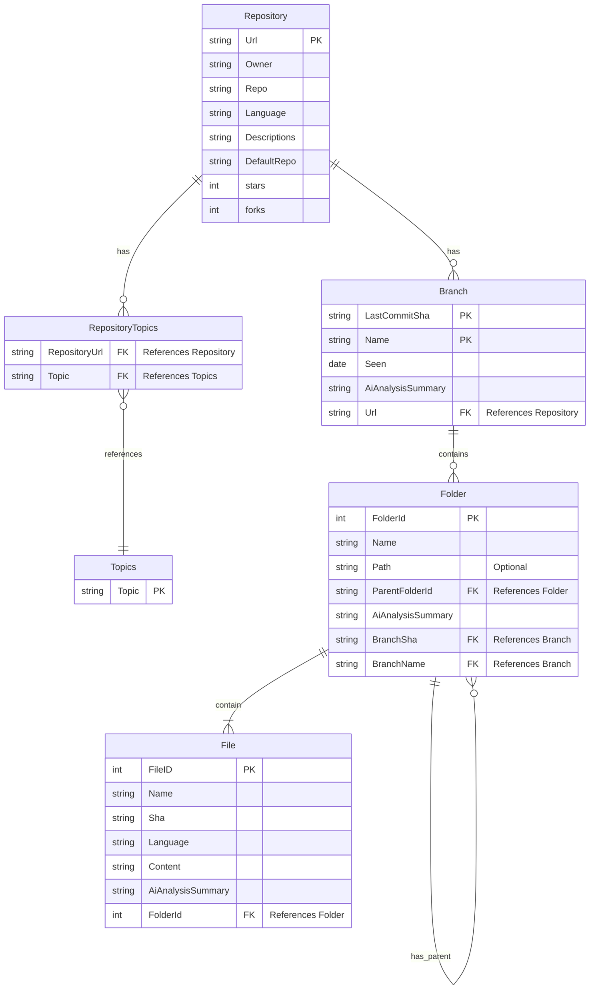

# 1. Use Cases

## 1.1 Analyze GitHub Repository

**Actors:** System, User (by request)

**Goals:** To automatically generate a comprehensive summary and analysis of a GitHub repository, including its purpose, structure, and core functionalities. This should be done while respecting GitHub's API rate limits and considering potential budget constraints.

**Trigger:** A request to analyze a specific GitHub repository (either explicitly by a user or triggered by another event).

**Basic Flow:**

1. **Fetch Repository Metadata:** The system retrieves the repository's basic information (owner, name, description, etc.) from GitHub.
2. **Check for Existing Analysis:** The system verifies if a recent analysis of the repository already exists in the database. If so, and the analysis is considered up-to-date, skip to View Repository Wiki.
3. **Handle Rate Limiting (Initial Check):** The system checks its current rate limit status with the GitHub API. If nearing the limit, it may delay further requests or prioritize based on available budget (see sub-use case 1.2).
4. **Fetch Repository File Tree:** The system retrieves the hierarchical structure of files and directories within the repository, respecting rate limits.
5. **Analyze with LLM (RAG):** The system processes the retrieved data using an LLM with RAG to understand the repository's code and structure.
6. **Store Analysis:** The generated analysis, including summaries and key information, is stored and associated with the repository, along with a timestamp.

**Postconditions:**

- A detailed analysis of the repository is generated and stored, potentially with limitations based on rate limits or budget.
- The analysis can be used to create a user-friendly wiki page.

**Exceptions:**

- **Invalid Repository/User:** The provided GitHub URL or user is not valid or does not exist.
    - The system informs the user that the repository or user could not be found.
- **GitHub API Rate Limit Exceeded:** The system has exceeded the allowed number of requests to the GitHub API.
    - The system will pause the analysis and resume after a specified time when the rate limit resets. Logs error.
- **Budget Constraints:** The analysis is limited due to budget considerations (e.g., limiting the number of files fetched or the depth of analysis).
    - The system will not analyze if it reached the budget to analyze the repo. (LLM cost, DB cost etc.)

## 1.2 View Repository Wiki

**Actors:** System, User

**Goals:** To allow users to view the generated wiki page for a specific GitHub repository.

**Trigger:** A user requests to view the wiki for a repository.

**Basic Flow:**

1. **Retrieve Wiki Data:** The system checks if an analysis (wiki) exists for the requested repository.
2. **Generate Wiki (if needed):** If no wiki exists, the "Analyze GitHub Repository" use case is triggered. If the budget does not allow it and generates error log.
3. **Display Wiki:** The system presents the wiki information to the user in a readable format. The code will be displayed like canvas (OpenAI’s canvas feature) and explain the codebase step by step with highlighting.

**Postconditions:**

- The user can view a comprehensive overview of the repository, including its purpose, structure, and key features.

**Exceptions:**

- **No Wiki Data Available:** No analysis data is available for the requested repository, and the system cannot generate it due to budget limitations or other errors.
    - The system informs the user that no wiki is available and may suggest analyzing the repository if the budget allows.
- **Rate Limiting Prevents Wiki Generation:** The system is currently unable to analyze the repository to generate a wiki due to GitHub API rate limits.
    - The system informs the user and suggests trying again later.

# 2. Plan

## 2.1 Crawling the Github Repo Information

Retrieve the repository information by providing the repo owner and the name of the repo

### 2.1.1 Information to fetch:

- owner.login (Name of the owner)
- name
- html_url
- language
- description
- stargazers_count (stars)
- forks
- default_branch

### 2.1.2 Example

https://api.github.com/repos/octocat/Hello-World

```json
{
  "name": "Hello-World",
  "full_name": "octocat/Hello-World",
  "owner": {
    "login": "octocat"
  },
  "html_url": "https://github.com/octocat/Hello-World",
  "description": "My first repository on GitHub!",
  "stargazers_count": 2769,
  "pushed_at": "2024-08-20T23:54:42Z",
	"topics": [

  ],
  "forks": 2499,
  "default_branch": "master"
}
```

## 2.2 Crawl the file tree of the Repository

Retrieve the file tree of the given repository by providing the repo owner, the name of the repo, and the commit hash.

### 2.2.1 Information to fetch:

- path
- files
- subdirectories

### 2.2.2 Example

https://api.github.com/repos/Octocat/Hello-World/contents?ref=7fd1a60b01f91b314f59955a4e4d4e80d8edf11d

```json
[
  {
    "name": "README",
    "path": "README",
    "sha": "980a0d5f19a64b4b30a87d4206aade58726b60e3",
    "size": 13,
    "url": "https://api.github.com/repos/octocat/Hello-World/contents/README?ref=7fd1a60b01f91b314f59955a4e4d4e80d8edf11d",
    "html_url": "https://github.com/octocat/Hello-World/blob/7fd1a60b01f91b314f59955a4e4d4e80d8edf11d/README",
    "git_url": "https://api.github.com/repos/octocat/Hello-World/git/blobs/980a0d5f19a64b4b30a87d4206aade58726b60e3",
    "download_url": "https://raw.githubusercontent.com/octocat/Hello-World/7fd1a60b01f91b314f59955a4e4d4e80d8edf11d/README",
    "type": "file",
    "_links": {
      "self": "https://api.github.com/repos/octocat/Hello-World/contents/README?ref=7fd1a60b01f91b314f59955a4e4d4e80d8edf11d",
      "git": "https://api.github.com/repos/octocat/Hello-World/git/blobs/980a0d5f19a64b4b30a87d4206aade58726b60e3",
      "html": "https://github.com/octocat/Hello-World/blob/7fd1a60b01f91b314f59955a4e4d4e80d8edf11d/README"
    }
  }
]
```

## 2.3 Crawl the files (Code) of the Repository

Retrieve the file of the repository by providing the repo owner, the name of the repo, hash of the given commit to refer the file, full file path including the filename

### 2.3.1 Information to fetch:

- file (Plain text or any format based on file extension)

### 2.3.2 Example

https://raw.githubusercontent.com/octocat/Hello-World/7fd1a60b01f91b314f59955a4e4d4e80d8edf11d/README

```
Hello World!
```

## 2.4 Use LLM with RAG to summarize information

### 2.4.1 Document Splitter

Splitting document based on the code provided. Planning to split by code blocks providing specific line number will be ideal for LLM to ingest data

[How to split code | 🦜️🔗 Langchain](https://js.langchain.com/docs/how_to/code_splitter)

```jsx
// Provided example from https://js.langchain.com/docs/how_to/code_splitter/
// From
const JS_CODE = `
	function helloWorld() {
	  console.log("Hello, World!");
	}

	// Call the function
	helloWorld();
`;

// To
[
  Document {
    pageContent: 'function helloWorld() {\n  console.log("Hello, World!");\n}',
    metadata: { loc: { lines: { from: 2, to: 4 } } }
  },
  Document {
    pageContent: "// Call the function\nhelloWorld();",
    metadata: { loc: { lines: { from: 6, to: 7 } } }
  }
]
```

### 2.4.2 Embedding

Convert the documents into vector of numbers for contextual understanding

[Introducing text and code embeddings](https://openai.com/index/introducing-text-and-code-embeddings/)

[Gemini API pricing  |  Google AI for Developers](https://ai.google.dev/pricing#text-embedding004)

### 2.4.3 VectorStore

Store vectors of numbers that were converted from numbers. We will use Chroma VectorStore for production. (Due to reliability) But now use Memory VectorStore for now.

[MemoryVectorStore | 🦜️🔗 Langchain](https://js.langchain.com/docs/integrations/vectorstores/memory/)

[Chroma | 🦜️🔗 Langchain](https://js.langchain.com/docs/integrations/vectorstores/chroma/)

### 2.4.4 Chaining

Let the LLM analyze our codebase and return the explanation of the codebase structure, how the folder structure looks like, Some core functionalities.

```bash
import { ChatPromptTemplate } from "@langchain/core/prompts";

const prompt = ChatPromptTemplate.fromMessages([
  [
    "system",
    "You are a helpful assistant that translates {input_language} to {output_language}.",
  ],
  ["human", "{input}"],
]);

const chain = prompt.pipe(llm);
await chain.invoke({
  input_language: "English",
  output_language: "German",
  input: "I love programming.",
});
```

[How use a vector store to retrieve data | 🦜️🔗 Langchain](https://js.langchain.com/v0.2/docs/how_to/vectorstore_retriever/)

# 3. File Structure (Logic)

- Agent
    - LLMProvider
    - Prompt
    - RAG (Document Splitter, Embedding, VectorStore)
- ChatEngine
    - GenerateDocument
- GithubRepo
    - File Retriever
    - Repo Dataclass
- DB-Connector
    - Check if User given Repo Exists
    - Input the created researched Wiki
    - Save Repo to DB
- Runner (Main)

# 4. DB Modelling


